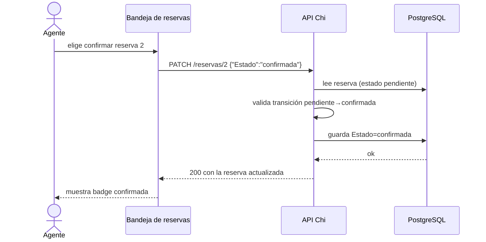

# Hito 1 · Addendum técnico

**Pareja:** Gonzalez Reina Isaac Mateo · Velez Briones Jipson Jordan  
**Paralelo:** Aplicación para el Servidor Web A

## A. Estructura del proyecto

```
.
├── main.go                 → arranque, config, AutoMigrate, -reset, rutas Chi
├── go.mod / go.sum         → módulo y dependencias
├── .env.example            → plantilla de variables (sin secretos reales)
├── README.md               → cómo levantar el servidor
├── internal/
│   ├── config/             → lectura de entorno (DATABASE_URL, PUERTO, …)
│   ├── middleware/         → registro de peticiones y recuperación de pánico
│   ├── respuesta/          → envoltura JSON { ok, datos | error }
│   └── reservas/
│       ├── modelos.go      → Sucursal, Usuario, Cliente, Vehiculo, Reserva, Pago
│       ├── manejadores.go  → CRUD reservas, PATCH estado, listados
│       ├── semilla.go      → datos de ejemplo
│       └── manejadores_test.go
├── DOC/
│   ├── hito1_ficha_del_negocio.md
│   └── hito1_addendum.md
├── docs/
│   ├── decisiones.md
│   └── pruebas.md
└── .github/workflows/      → CI con go test
```

## B. Configuración y secretos

| Variable | Para qué sirve | Ejemplo (sin datos reales) |
|----------|----------------|----------------------------|
| DATABASE_URL | Cadena de conexión a PostgreSQL (incluye contraseña) | host=localhost user=postgres password=CAMBIE_ESTO dbname=rentcar port=5433 |
| PUERTO | Puerto HTTP del servidor | 8080 |
| TIEMPO_ESPERA_SEGUNDOS | Timeout de lectura/escritura del servidor | 5 |

**Archivo de ejemplo:** `.env.example` en la raíz del repositorio. El archivo `.env` real está en `.gitignore` y no se sube.

## C. Pruebas

| Prueba | Qué caso cubre |
|--------|----------------|
| TestCrear / JSON roto | POST /reservas con cuerpo inválido → 400 |
| TestCrear / estado inventado | Estado fuera de la lista → 422 |
| TestCrear / ClienteID cero | Validación de negocio → 422 |
| TestCrear / fecha fin no posterior | Regla de fechas → 422 |
| TestVerUnoConIDQueNoEsNumeroResponde400 | GET /reservas/abc → 400 |
| TestListarConLimitNoNumericoResponde400 | GET /reservas?limit=abc → 400 |
| TestCambiarEstadoJSONRotoResponde400 | PATCH con JSON roto → 400 |
| TestCambiarEstadoInventadoResponde422 | PATCH con estado inventado → 422 |
| TestTransicionPermitida | Tabla de transiciones legales/ilegales |
| TestCargarSinDatabaseURLFalla | Config sin DATABASE_URL falla con mensaje claro |

**Captura de `go test ./...`:**


## D. Boceto de la pantalla principal

Pantalla **Bandeja de reservas** (consume `GET /reservas`). Muestra ID, cliente, vehículo, fechas, total y el **estado** en la última columna.


## E. Diagrama de secuencia del caso de uso principal

Confirmación de una reserva pendiente tras verificar el pago:



## F. Capturas de respuestas

**Caso correcto:** `POST /reservas` con fechas válidas → **201**


**Caso con error de validación:** `POST /reservas` con fecha fin anterior al inicio → **422**


