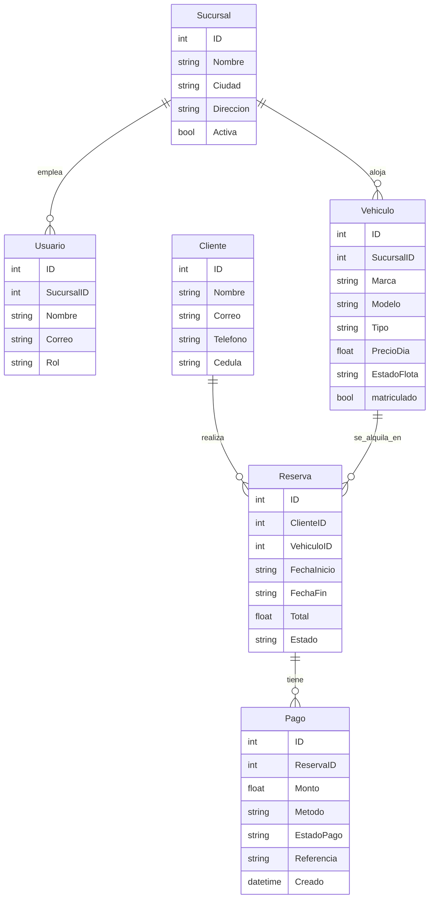
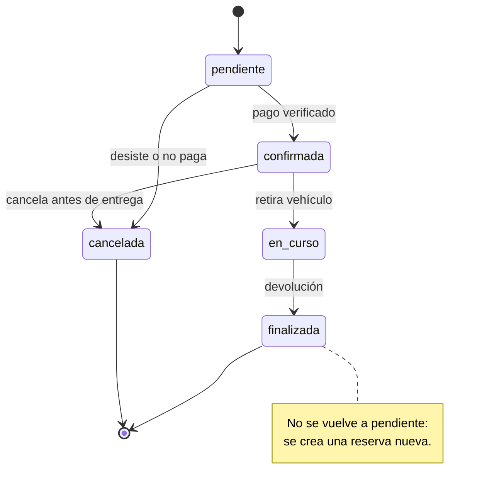

# Hito 1 · Ficha del negocio

**Pareja:** Gonzalez Reina Isaac Mateo · Velez Briones Jipson Jordan  
**Paralelo:** Aplicación para el Servidor Web A  
**Negocio en una línea:** RentCar alquila autos y camionetas por día a viajeros y residentes en Manabí, cobrando por transferencia o en mostrador.

## 1. Negocio de referencia

**Enlace:** https://www.cars-rentals.com/?lang=es&campaignid=23586261106&adgroupid=196525028634&lpage=k&lb=kapi&lang=es&gad_source=1&gad_campaignid=23586261106&gbraid=0AAAAAoUOyroNWplN_gTb1ZCDoUz15p9Ak&gclid=Cj0KCQjw5vLVBhCiARIsAD56SFL2UOdXBTQrFcDreDDUAkllX0dIHFVe9eFddbSto0suCqbqbXncjWMaAiYrEALw_wcB

El caso de referencia es el de anfitriones de flota en Turo, el marketplace peer-to-peer de alquiler de vehículos por día. Una anfitriona en Miami, Natalia Zorina, declara haber facturado unos **922.000 USD** en un año con una flota de 69 autos, cobrando tarifas diarias a conductores que reservan por la app. El modelo no vende el auto: vende **días de uso**. Quien gana dinero es el dueño de la flota (o la plataforma, vía comisión). El cobro es por adelantado o con garantía; el margen depende de la ocupación, el mantenimiento y el costo de capital de las unidades. Turo, como plataforma, reportó cientos de millones en ingresos anuales con un enfoque asset-light (sin hardware obligatorio en el auto) y alquiler por día, no por hora. Para RentCar tomamos la lógica de negocio local: flota propia o gestionada, catálogo de autos y camionetas, reserva con fechas y total calculado por días, y un flujo de confirmación cuando el pago queda verificado. No copiamos el marketplace global: adaptamos el cobro diario y la gestión de disponibilidad a una agencia web en Ecuador.

## 2. Caso de contraste

**Fuente:** https://www.startupecosystem.ca/news/kyte-rental-car-startup-shuts-down-amid-financial-struggles/

Getaround partió del mismo espacio (compartir autos entre particulares) pero empujó alquiler por hora con hardware en el vehículo y una expansión costosa. Tras recaudar cientos de millones, su ingreso reportado quedó lejos del de Turo y cerró operaciones en Estados Unidos. **Hipótesis de fondo:** el modelo de cobro y de costos. Getaround cargó con dispositivos, instalación y operaciones densas en ciudad, mientras Turo simplificó a reservas diarias sin hardware obligatorio. En un mercado con menor ticket y más informalidad, ese sobrecosto mata el margen antes de escalar. Por eso RentCar no apunta a “desbloqueo por app + hora”, sino a **alquiler por día de autos y camionetas** en sucursal, con comprobante de pago verificable y estados de reserva que reflejan el dinero real, no solo el clic.

## 3. Adaptación al Ecuador

1. **Medios de pago:** la mayoría de clientes paga por transferencia bancaria y envía foto o número de comprobante. Efecto: la reserva nace en `pendiente` y solo pasa a `confirmada` cuando un agente marca el pago como verificado. Por eso existe la entidad **Pago** con estado `por_verificar`.
2. **Facturación y RUC:** la agencia necesita RUC y comprobantes electrónicos SRI. Efecto: no borramos reservas ni pagos históricos; el vehículo con reservas no se elimina (restricción de integridad). El historial queda en `Reserva` y `Pago`.
3. **Poder adquisitivo y flota local (Manabí):** el segmento no sostiene una flota de lujo ni motos de alto cilindraje para renta formal. Efecto: el tipo de **Vehiculo** se cierra a `auto` y `camioneta`; se descartan motos del catálogo para enfocarnos en familia y carga ligera.

**Qué cambió en el modelo por estas restricciones:** se agregó la entidad **Pago** y el estado inicial `pendiente` en **Reserva**; se fijó el dominio de `Tipo` del vehículo a solo dos valores; se endureció la política de no borrar activos con historial.

## 4. Modelo de datos

Vista completa (secciones 4 y 5 en una sola imagen):


### Entidad: Sucursal

| Atributo | Tipo | Obligatorio | Ejemplo |
|----------|------|-------------|---------|
| ID | número entero | sí | 1 |
| Nombre | texto | sí | RentCar Manta Centro |
| Ciudad | texto | sí | Manta |
| Direccion | texto | sí | Av. 24 y Calle 13 |
| Activa | sí/no | sí | sí |

### Entidad: Usuario

| Atributo | Tipo | Obligatorio | Ejemplo |
|----------|------|-------------|---------|
| ID | número entero | sí | 1 |
| SucursalID | referencia a Sucursal | sí | 1 |
| Nombre | texto | sí | Jipson Velez |
| Correo | texto | sí | jipson@rentcar.ec |
| Rol | uno de: administrador, agente | sí | administrador |

### Entidad: Cliente

| Atributo | Tipo | Obligatorio | Ejemplo |
|----------|------|-------------|---------|
| ID | número entero | sí | 1 |
| Nombre | texto | sí | Ana Pérez |
| Correo | texto | sí | ana@example.com |
| Telefono | texto | no | 0991111111 |
| Cedula | texto | sí | 1310000001 |

### Entidad: Vehiculo

| Atributo | Tipo | Obligatorio | Ejemplo |
|----------|------|-------------|---------|
| ID | número entero | sí | 1 |
| SucursalID | referencia a Sucursal | sí | 1 |
| Marca | texto | sí | Toyota |
| Modelo | texto | sí | Corolla |
| Tipo | uno de: auto, camioneta | sí | auto |
| PrecioDia | número decimal | sí | 35.00 |
| EstadoFlota | uno de: disponible, alquilado, mantenimiento | sí | disponible |

### Entidad: Reserva

| Atributo | Tipo | Obligatorio | Ejemplo |
|----------|------|-------------|---------|
| ID | número entero | sí | 1 |
| ClienteID | referencia a Cliente | sí | 1 |
| VehiculoID | referencia a Vehiculo | sí | 1 |
| FechaInicio | fecha | sí | 2026-09-20 |
| FechaFin | fecha | sí | 2026-09-23 |
| Total | número decimal | sí | 105.00 |
| Estado | uno de: pendiente, confirmada, en_curso, finalizada, cancelada | sí | pendiente |

### Entidad: Pago

| Atributo | Tipo | Obligatorio | Ejemplo |
|----------|------|-------------|---------|
| ID | número entero | sí | 1 |
| ReservaID | referencia a Reserva | sí | 1 |
| Monto | número decimal | sí | 105.00 |
| Metodo | uno de: transferencia, efectivo | sí | transferencia |
| EstadoPago | uno de: por_verificar, verificado, rechazado | sí | por_verificar |
| Referencia | texto | no | TRX-1001 |
| Creado | fecha y hora | sí | 2026-09-19 10:00 |

### Relaciones

| Entidades | Cardinalidad | Frase |
|-----------|--------------|-------|
| Sucursal — Usuario | 1 : N | Una sucursal emplea muchos usuarios; cada usuario pertenece a una sucursal |
| Sucursal — Vehiculo | 1 : N | Una sucursal aloja muchos vehículos; cada vehículo está en una sucursal |
| Cliente — Reserva | 1 : N | Un cliente realiza muchas reservas; cada reserva es de un cliente |
| Vehiculo — Reserva | 1 : N | Un vehículo se alquila en muchas reservas; cada reserva es de un vehículo |
| Reserva — Pago | 1 : N | Una reserva puede tener varios pagos/comprobantes; cada pago pertenece a una reserva |

### Structs en Go

```go
type Sucursal struct {
    ID        uint   `gorm:"primaryKey" json:"ID"`
    Nombre    string `gorm:"not null" json:"Nombre"`
    Ciudad    string `gorm:"not null" json:"Ciudad"`
    Direccion string `gorm:"not null" json:"Direccion"`
    Activa    bool   `gorm:"not null;default:true" json:"Activa"`
}

type Usuario struct {
    ID         uint     `gorm:"primaryKey" json:"ID"`
    SucursalID uint     `gorm:"not null;index" json:"SucursalID"`
    Nombre     string   `gorm:"not null" json:"Nombre"`
    Correo     string   `gorm:"not null" json:"Correo"`
    Rol        string   `gorm:"not null" json:"Rol"`
}

type Cliente struct {
    ID       uint   `gorm:"primaryKey" json:"ID"`
    Nombre   string `gorm:"not null" json:"Nombre"`
    Correo   string `gorm:"not null" json:"Correo"`
    Telefono string `json:"Telefono"`
    Cedula   string `gorm:"not null" json:"Cedula"`
}

type Vehiculo struct {
    ID          uint      `gorm:"primaryKey" json:"ID"`
    SucursalID  uint      `gorm:"not null;index" json:"SucursalID"`
    Marca       string    `gorm:"not null" json:"Marca"`
    Modelo      string    `gorm:"not null" json:"Modelo"`
    Tipo        string    `gorm:"not null" json:"Tipo"`
    PrecioDia   float64   `gorm:"not null" json:"PrecioDia"`
    EstadoFlota string    `gorm:"not null;default:disponible" json:"EstadoFlota"`
    Reservas    []Reserva `json:"Reservas,omitempty"`
}

type Reserva struct {
    ID          uint    `gorm:"primaryKey" json:"ID"`
    ClienteID   uint    `gorm:"not null;index" json:"ClienteID"`
    VehiculoID  uint    `gorm:"not null;index" json:"VehiculoID"`
    FechaInicio string  `gorm:"not null" json:"FechaInicio"`
    FechaFin    string  `gorm:"not null" json:"FechaFin"`
    Total       float64 `gorm:"not null" json:"Total"`
    Estado      string  `gorm:"not null" json:"Estado"`
    Pagos       []Pago  `json:"Pagos,omitempty"`
}

type Pago struct {
    ID         uint      `gorm:"primaryKey" json:"ID"`
    ReservaID  uint      `gorm:"not null;index" json:"ReservaID"`
    Monto      float64   `gorm:"not null" json:"Monto"`
    Metodo     string    `gorm:"not null" json:"Metodo"`
    EstadoPago string    `gorm:"not null" json:"EstadoPago"`
    Referencia string    `json:"Referencia"`
    Creado     time.Time `json:"Creado"`
}
```

**Decisión de tipos que tuvimos que pensar:** `FechaInicio` y `FechaFin` van como `string` con formato `YYYY-MM-DD` (no `time.Time`) porque el contrato JSON del taller y Bruno envían solo la fecha de calendario, sin zona horaria; `Creado` del pago sí es `time.Time` porque importa la hora de registro del comprobante.

### Diagrama del modelo completo



**Decisión discutible del modelo y por qué la tomamos:** **Pago** es entidad aparte y no un campo de Reserva, porque una reserva puede acumular varios comprobantes (adelanto, saldo, reintento tras rechazo) cada uno con método, referencia y momento distintos.

## 5. Máquina de estados

**Entidad con estados:** Reserva

| Estado | Qué significa |
|--------|---------------|
| pendiente (inicial) | Reserva creada; pago aún no verificado o pendiente de depósito |
| confirmada | Pago aceptado; vehículo asignado para las fechas |
| en_curso | El cliente ya retiró el vehículo |
| finalizada | Vehículo devuelto; contrato cerrado |
| cancelada | Reserva anulada antes o al confirmar |

| De | A | Quién la hace | Condición |
|----|---|---------------|-----------|
| pendiente | confirmada | agente / administrador | Hay pago verificado o garantía en mostrador |
| pendiente | cancelada | cliente o agente | El cliente desiste o no paga a tiempo |
| confirmada | en_curso | agente | El cliente retira el vehículo en sucursal |
| confirmada | cancelada | agente / administrador | Cancelación antes de la entrega |
| en_curso | finalizada | agente | El vehículo se devolvió |

**Transición prohibida y por qué:** de `finalizada` (o `cancelada`) no se vuelve a `pendiente`. Si el cliente vuelve a alquilar, se abre una reserva nueva; reabrir falsearía historial, totales y tiempos de ocupación.

### Diagrama de estados




## 6. Roles y permisos

| Acción | Cliente | Agente | Administrador |
|--------|---------|--------|---------------|
| Ver catálogo de vehículos | sí | sí | sí |
| Crear reserva propia | sí | sí | sí |
| Ver todas las reservas | no | todos | todos |
| Ver solo sus reservas | solo los suyos | sí | sí |
| Cambiar estado de reserva (PATCH) | no | sí | sí |
| Registrar / verificar pago | no | sí | sí |
| Gestionar vehículos y sucursales | no | no | sí |

## 7. Mapa de endpoints por rol

| Endpoint | Rol que lo llama | Pantalla que lo consume | Qué devuelve | Qué valida | Código si falla |
|----------|------------------|-------------------------|--------------|------------|-----------------|
| POST /reservas | Cliente / Agente | Nueva reserva | Reserva creada | JSON, estado, fechas, ClienteID y VehiculoID existentes | 400 / 422 |
| GET /reservas | Agente / Administrador | Bandeja de reservas | Lista (filtro estado, limit, offset) | limit/offset numéricos | 400 |
| GET /reservas/{id} | Agente / Cliente | Detalle de reserva | Una reserva | id numérico y existencia | 400 / 404 |
| PATCH /reservas/{id} | Agente / Administrador | Detalle / cambiar estado | Reserva con nuevo estado | estado válido y transición permitida | 400 / 404 / 422 |
| PUT /reservas/{id} | Agente / Administrador | Editar reserva | Reserva actualizada | fechas, total, transición; no cambia VehiculoID | 400 / 404 / 422 |
| GET /vehiculos | Cliente / Agente | Catálogo | Vehículos con reservas (Preload) | — | 500 si falla la base |

### Matriz pantalla × endpoint

| Pantalla | GET /reservas | POST /reservas | PATCH /reservas/{id} | GET /reservas/{id} | GET /vehiculos |
|----------|---------------|----------------|----------------------|--------------------|----------------|
| Catálogo | | | | | X |
| Nueva reserva | | X | | | X |
| Bandeja de reservas | X | | | | |
| Detalle de reserva | | | X | X | |

**Endpoints que ya están funcionando y en qué archivo:** CRUD de reservas, PATCH de estado, listados de vehículos/sucursales/clientes/usuarios/pagos en `internal/reservas/manejadores.go` (registro en `Rutas`).

## 8. Declaración de IA

Cursor (Composer) para completar la ficha, el addendum, los structs de las seis entidades, el PATCH con máquina de estados y las pruebas de tabla; la pareja revisó el modelo de negocio (solo autos y camionetas) y las transiciones.
